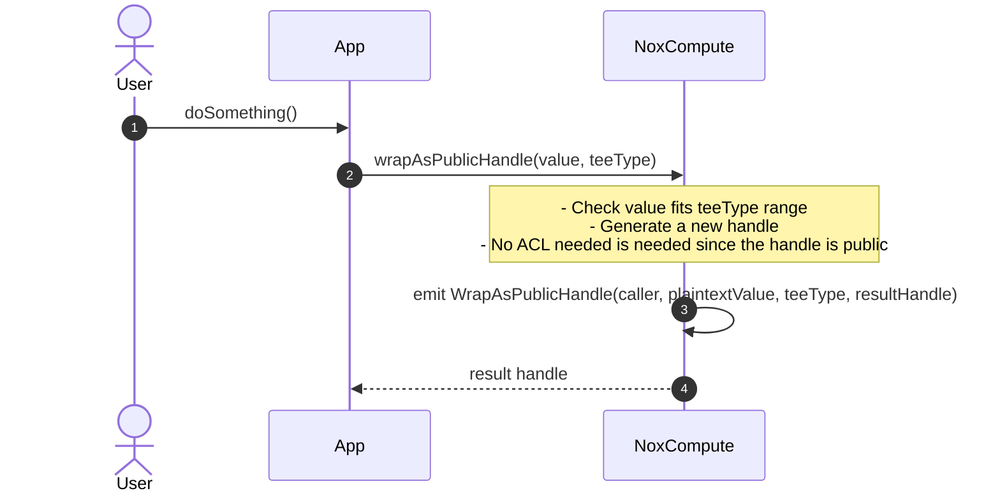
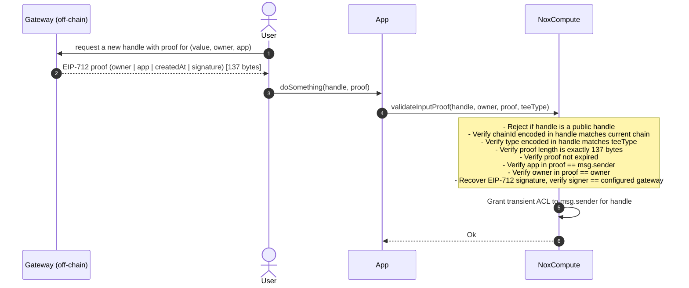
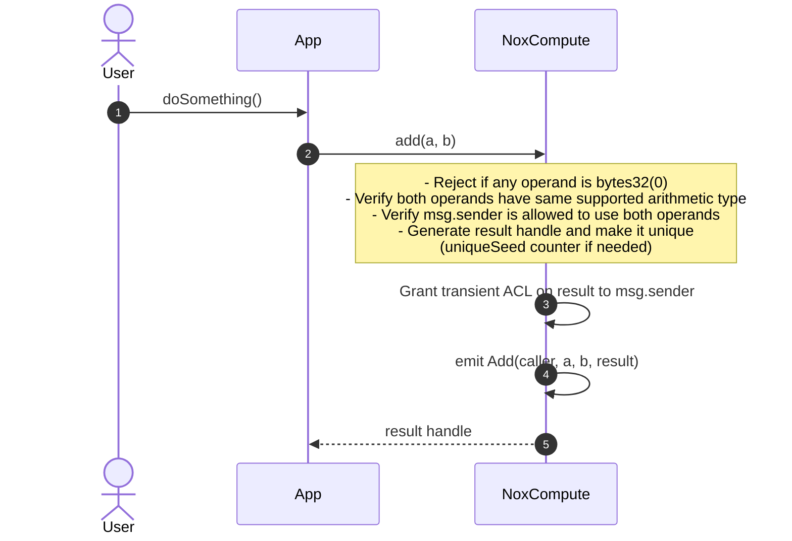
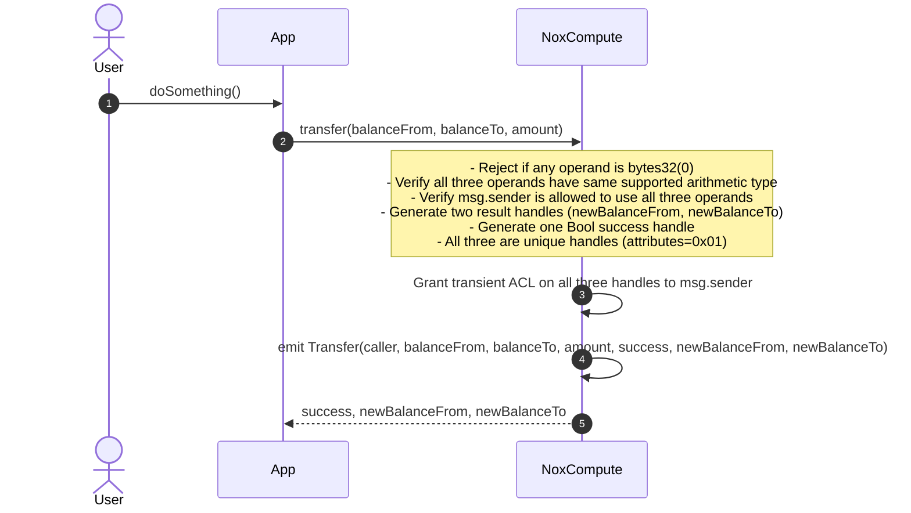
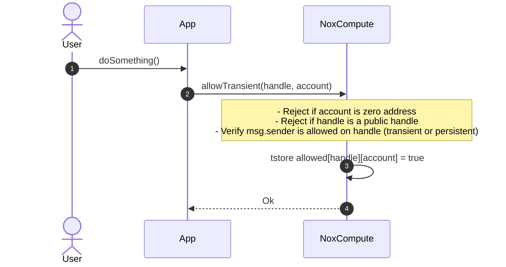
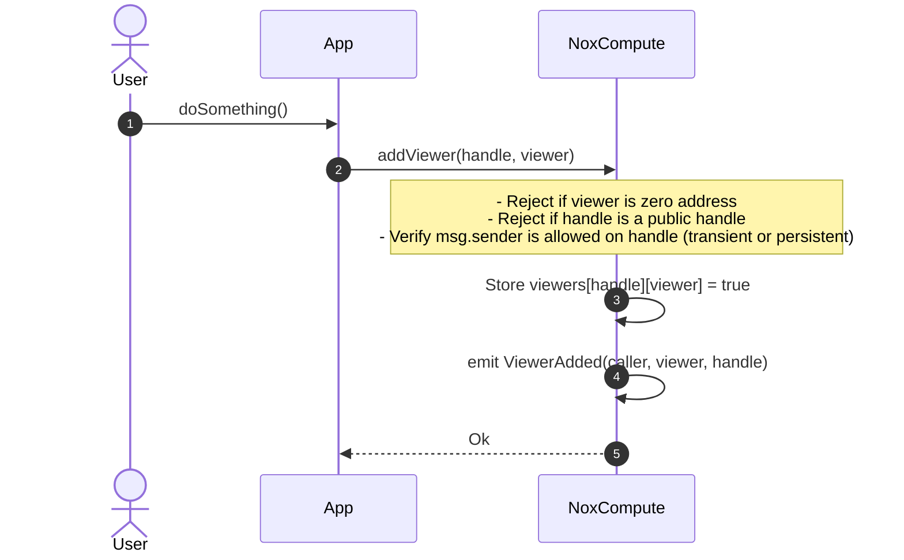
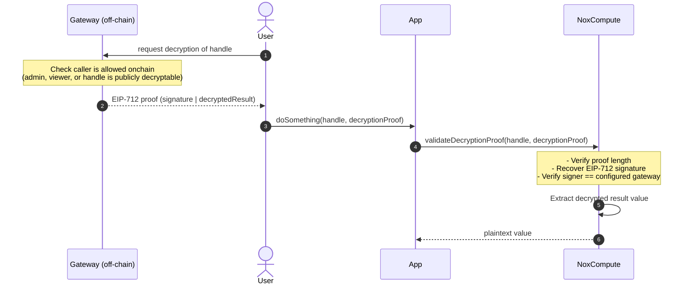

# NoxCompute — Documentation

## Diagrams

### Contract Inheritance

`NoxCompute` is a concrete UUPS-upgradeable contract assembled from four abstract modules. `Common` is the shared base that defines the ERC7201 storage struct and virtual cross-module hooks. `Admin` handles role-based configuration (KMS public key, gateway address, proof expiration) guarded by `UPGRADER_ROLE`. `ACL` manages persistent and transient access to encrypted handles using EIP-1153 transient storage. `Compute` implements EIP-712 proof validation and all TEE operation dispatch, emitting events consumed by off-chain TEE workers.


---

### Storage Layout

`NoxComputeStorage` is stored at the ERC7201 namespaced slot derived from `"nox.storage.NoxCompute"` (`0x118a...cd00`). The struct holds the two-level ACL mappings (`admins`, `viewers`), the public-decryption flag, the KMS public key bytes, the gateway address, the proof expiration duration, and a counter used to guarantee handle uniqueness when all operands are public handles. The diagram is generated from `NoxComputeStorageStub`, a mock contract that mirrors the struct at sequential slots so sol2uml can render it.


---

## Sequence Diagrams

### 1. `wrapAsPublicHandle` — Create a deterministic public handle

A public handle is a deterministic, globally accessible commitment to a plaintext value. The same `(value, teeType, chainId, NoxCompute address)` always produces the same handle, so no ACL entry is needed — anyone can use it as a computation input. The emitted event lets off-chain TEE workers learn the plaintext behind the handle.



---

### 2. `validateInputProof` — Validate a gateway-issued handle proof

Before an app can use a user-supplied encrypted handle as a computation input, it must prove the handle was legitimately issued by the gateway for that specific owner and app. The gateway signs an EIP-712 `HandleProof` off-chain binding the handle to an owner, an app, and a timestamp. `validateInputProof` verifies all fields and, on success, grants the calling app transient ACL on the handle for the current transaction.



---

### 3. `add`, `sub` ... — Arithmetic, safe-arithmetic, and comparison operations

Applies to all arithmetic and comparison operators: `add`, `sub`, ..., `safeAdd`, `select`, ..., `eq`, ... The contract does not compute the result — it validates access, generates a unique result handle, and emits an event that TEE workers pick up to perform the actual computation off-chain.



---

### 4. `transfer(/mint/burn)` — Optimized operations

Unlike simple arithmetic ops, these return two result handles plus a Bool success handle. The TEE computes the operation off-chain and the success handle's decrypted value indicates whether the operation succeeded (e.g. sufficient balance for transfer).



---

### 5. `allow` — Grant persistent access to a handle

Grants another address permanent admin access to a handle. The caller must already have access (transient or persistent). Once granted, persistent access cannot be revoked.


---

### 6. `allowTransient` — Grant transient access to a handle

Grants another address access to a handle for the current transaction only. Access is stored in EIP-1153 transient storage and is automatically cleared at the end of the transaction.



---

### 7. `addViewer` — Grant decryption-only access to a handle

Grants an address viewer access to a handle. A viewer can request decryption off-chain from the TEE but cannot use the handle as a computation input. Persistent and irrevocable.



---

### 8. `allowPublicDecryption` — Make a handle publicly decryptable

Marks a handle as publicly decryptable, allowing anyone to request its decryption from the TEE without any ACL entry. This is irreversible.


---

### 9. `validateDecryptionProof` — Verify a TEE decryption result

To read an encrypted value, a user requests decryption from the TEE off-chain. The TEE returns an EIP-712 signed proof binding the handle to the decrypted result. `validateDecryptionProof` verifies the proof on-chain and extracts the plaintext. This is a `view` function with no ACL check — access control for decryption is enforced the Gateway (running inside TEE) according to the on-chain state.



---

## Regenerate diagrams

```bash
pnpm run diagrams
```
