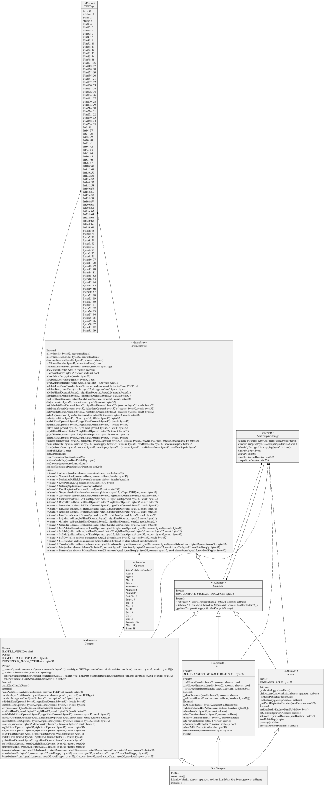
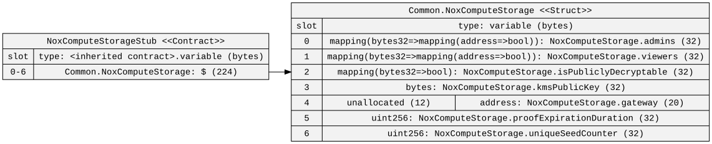
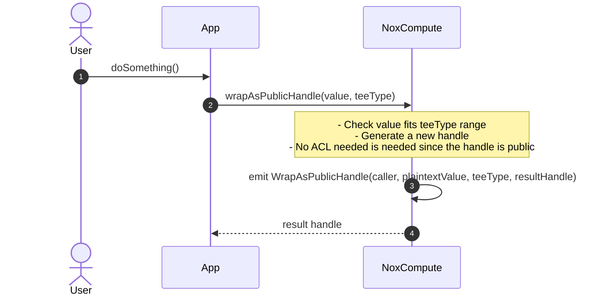
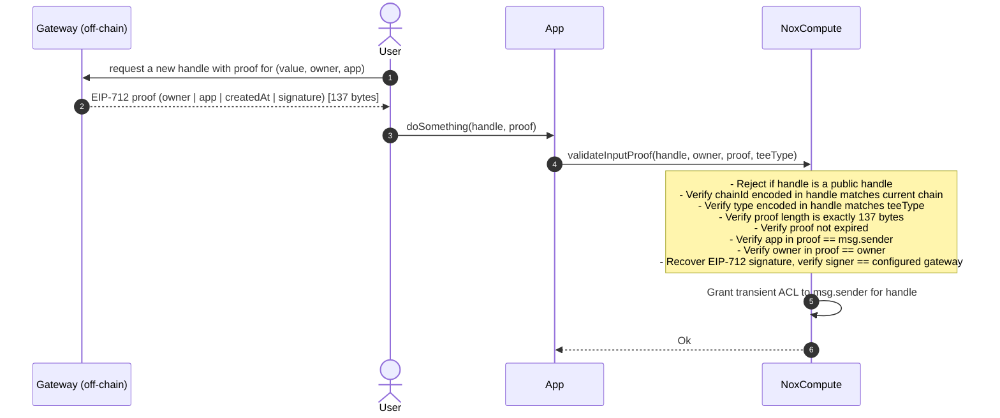

# NoxCompute — Documentation

## Diagrams

### Contract Inheritance

`NoxCompute` is a concrete UUPS-upgradeable contract assembled from four abstract modules. `Common` is the shared base that defines the ERC7201 storage struct and virtual cross-module hooks. `Admin` handles role-based configuration (KMS public key, gateway address, proof expiration) guarded by `UPGRADER_ROLE`. `ACL` manages persistent and transient access to encrypted handles using EIP-1153 transient storage. `Compute` implements EIP-712 proof validation and all TEE operation dispatch, emitting events consumed by off-chain TEE workers.



---

### Storage Layout

`NoxComputeStorage` is stored at the ERC7201 namespaced slot derived from `"nox.storage.NoxCompute"` (`0x118a...cd00`). The struct holds the two-level ACL mappings (`admins`, `viewers`), the public-decryption flag, the KMS public key bytes, the gateway address, the proof expiration duration, and a counter used to guarantee handle uniqueness when all operands are public handles. The diagram is generated from `NoxComputeStorageStub`, a mock contract that mirrors the struct at sequential slots so sol2uml can render it.



---

## Sequence Diagrams

### 1. `wrapAsPublicHandle` — Create a deterministic public handle

A public handle is a deterministic, globally accessible commitment to a plaintext value. The same `(value, teeType, chainId, NoxCompute address)` always produces the same handle, so no ACL entry is needed — anyone can use it as a computation input. The emitted event lets off-chain TEE workers learn the plaintext behind the handle.



---

### 2. `validateInputProof` — Validate a gateway-issued handle proof

Before an app can use a user-supplied encrypted handle as a computation input, it must prove the handle was legitimately issued by the gateway for that specific owner and app. The gateway signs an EIP-712 `HandleProof` off-chain binding the handle to an owner, an app, and a timestamp. `validateInputProof` verifies all fields and, on success, grants the calling app transient ACL on the handle for the current transaction.



---

## Regenerate diagrams

```bash
pnpm run diagrams
```
